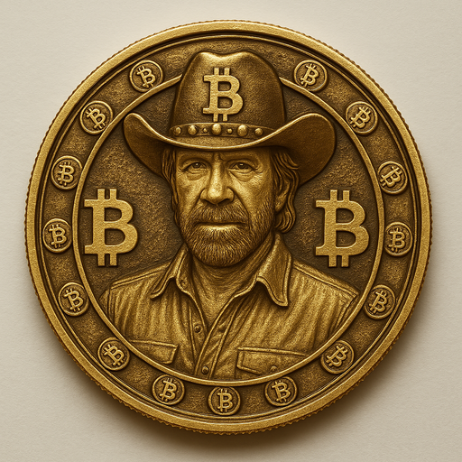

# Buck Norris ($BUCK) 🥋

**The Meme Coin with a Roundhouse Kick!**  
Fueled by community, humor, and blockchain technology.

---

## 🚀 What is Buck Norris?

**Buck Norris** is a meme-driven cryptocurrency built on the Binance Smart Chain (BSC).  
With unstoppable energy and community vibes, BUCK aims to punch its way into the hearts of degens, crypto-lovers, and meme lords alike.

---

## 🌐 Official Links

- 🔗 Website: [bucknorris.com](https://www.bucknorris.com)
- 📈 Chart: [GeckoTerminal](https://www.geckoterminal.com/bsc/pools/0x...)
- 📊 CoinMarketCap: [Buck Norris](https://coinmarketcap.com/currencies/buck-norris)
- 💬 Telegram: [t.me/bucknorriscoin](https://t.me/bucknorriscoin)
- 🐦 Twitter: [@bucknorriscoin](https://twitter.com/bucknorriscoin)
- 📘 Facebook: [facebook.com/bucknorriscoin](https://facebook.com/bucknorriscoin)

---

## 💼 Token Info

- **Name:** Buck Norris  
- **Symbol:** BUCK  
- **Type:** BEP20  
- **Decimals:** 18  
- **Contract:** `0x909ec2E99f0A8E5BF9C3bf2F7A5aCC44026D4dd3`  
- **Chain:** Binance Smart Chain

---

## 🛠️ Features

- ✅ Meme-first branding with Chuck-style impact  
- ✅ Visible on CoinMarketCap, GeckoTerminal & BSC Scan  
- ✅ App (coming soon!) with WalletConnect, slot machine & community features  
- ✅ Community powered – 100% transparency  

---

## 🧑‍💻 How to Contribute

1. ⭐ Star the repo  
2. Fork it  
3. Submit Pull Requests  
4. Join the community on Telegram  
5. Spread the meme!

---

### 📩 Contact

Want to partner, list, or build with us?  
Email: [info@bucknorris.com](mailto:info@bucknorris.com)

---

> "Buck Norris doesn’t stake tokens… tokens stake themselves in fear."  
> – Anonymous DeFi Legend
